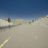

Behavior cloning data generated from CARLA's RoamingAgent on Town04

### Details

We follow CARLA's Town04 figure-8 loop indefinitely ([example video](https://drive.google.com/a/berkeley.edu/file/d/15IsPqlN7dKKemcE8VbE_Afebe-xVcDRi/view?usp=sharing)).

A bird's eye view of Town04 is:


### Datasets
 - 10k PNG images 48x48 in lane 1: [download (33 MB)](https://drive.google.com/a/berkeley.edu/file/d/1YZ5JxpK-RGM0XlK1F8NJppL7tTurgf_g/view?usp=sharing)



Each image has an associated action, embedded in the image's metadata:
```
# Load an image:
from PIL.PngImagePlugin import PngImageFile, PngInfo
im = PngImageFile("rl00001234.png")

# Actions are stored in the image's metadata:
print("Actions: %s" % im.text)
throttle = float(im.text['throttle'])  # range [0, 1]
steer = float(im.text['steer'])   # range [-1, 1]
brake = float(im.text['brake'])   # range [0, 1]
```
