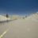
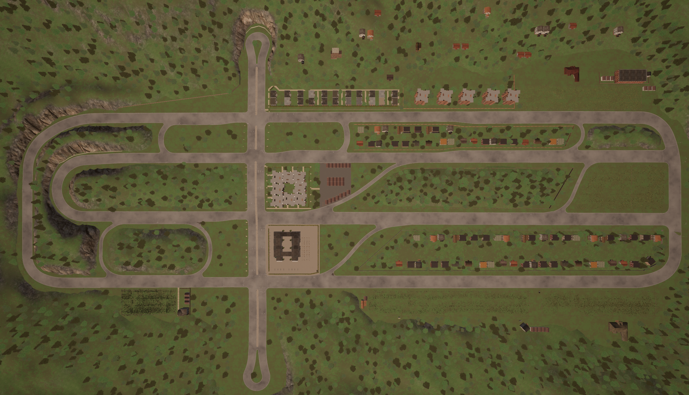
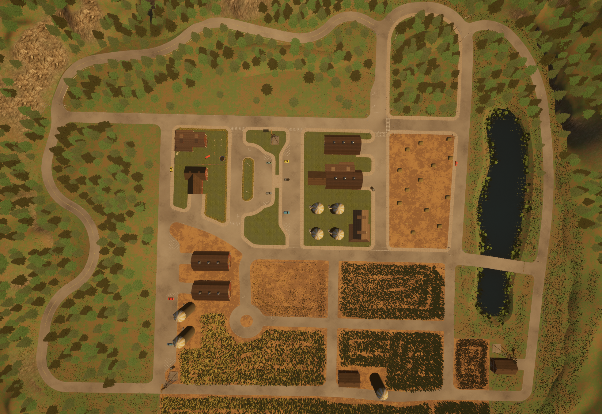

Driving data generated using a RoamingAgent from [CARLA](http://carla.org/) for behavior cloning.

### Town04 Data

We follow CARLA's Town04 figure-8 loop indefinitely ([example video](https://drive.google.com/a/berkeley.edu/file/d/15IsPqlN7dKKemcE8VbE_Afebe-xVcDRi/view?usp=sharing)),
shown from above here:


 - 10k PNG images 48x48 in lane 1 at 20Hz: [download (33 MB)](https://drive.google.com/a/berkeley.edu/file/d/1ZShsI8a_oU7gJSHvSmk7Z58uVC9FXsgc/view?usp=sharing)
 - 100k PNG images 48x48 in lane 1 at 20Hz: [download (325 MB)](https://drive.google.com/a/berkeley.edu/file/d/1HsVe84IMfhmL5pMEJMdm19MWEDyh18Gt/view?usp=sharing)


### Town06 Data
We follow CARLA's Town06 randomly, alone, ignoring traffic lights:


 - 100k PNG images 48x48 in at 20Hz: [download (347 MB)](https://drive.google.com/a/berkeley.edu/file/d/1vCa0GnqQgSsjFyU7MZM0p1q5PKTVHc-O/view?usp=sharing)

### Town07 Data
We follow CARLA's Town07 randomly, alone, ignoring traffic lights:


 - 100k PNG images 48x48 in at 20Hz: [download (372 MB)](https://drive.google.com/a/berkeley.edu/file/d/14LL_N-OZCfUxLMFXhioKwTDZCfqjPDP0/view?usp=sharing)

### Reading Data
Each image has an associated action, embedded in the image's metadata:
```
# Load an image:
from PIL.PngImagePlugin import PngImageFile
im = PngImageFile("vision00001234.png")  # Note some have "rl" prefix instead

# Actions are stored in the image's metadata:
print("Actions: %s" % im.text)
throttle = float(im.text['throttle'])  # range [0, 1]
steer = float(im.text['steer'])   # range [-1, 1]
brake = float(im.text['brake'])   # range [0, 1]
```

### Generating New Data
Place `data_collection_agent.py` CARLA 0.9.8's [navigation directory](https://github.com/carla-simulator/carla/tree/master/PythonAPI/carla/agents/navigation), and execute it.

First start CARLA's server:
```
conda activate carla98
bash CarlaUE4.sh -fps 20
```

Then choose the CARLA town you wish to use, and execute:
```
conda activate carla98
./PythonAPI/util/config.py --map Town07 --delta-seconds 0.05
python PythonAPI/carla/agents/navigation/data_collection_agent.py --vision_size 48 --vision_fov 90 --steps 100000
```

### Installing CARLA 0.9.8:

1. download: 
either from [here](https://github.com/carla-simulator/carla/releases) or here:
```
https://carla-releases.s3.eu-west-3.amazonaws.com/Linux/CARLA_0.9.8.tar.gz
https://carla-releases.s3.eu-west-3.amazonaws.com/Linux/AdditionalMaps_0.9.8.tar.gz
```

2: add to .bashrc
```
export PYTHONPATH=$PYTHONPATH:/home/CARLA_0.9.8/PythonAPI
export PYTHONPATH=$PYTHONPATH:/home/CARLA_0.9.8/PythonAPI/carla
export PYTHONPATH=$PYTHONPATH:/home/CARLA_0.9.8/PythonAPI/carla/dist/carla-0.9.8-py3.5-linux-x86_64.egg
```

3. Make env:
```
conda create -n carla98
conda activate carla98
pip install pygame
pip install networkx
```
